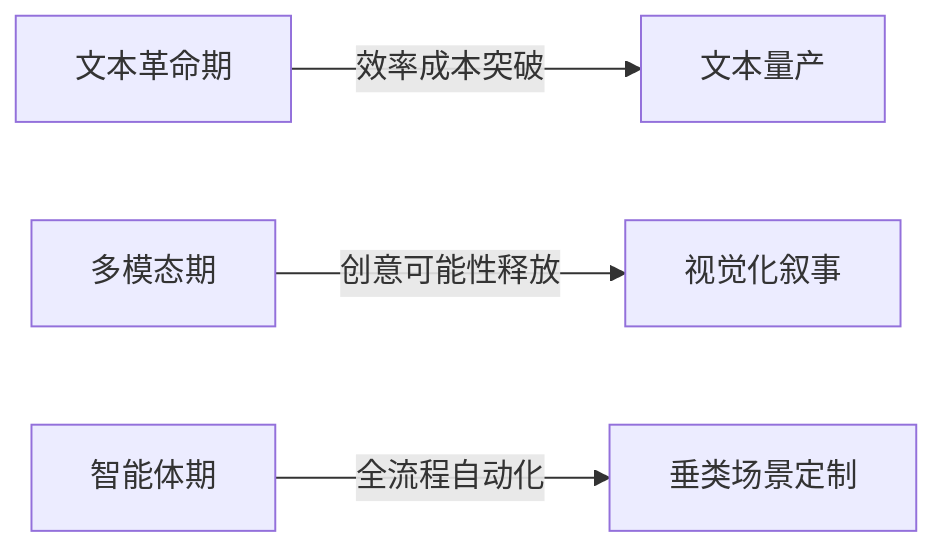

# AI内容创作演进路径全景报告（2022.11-2025.7）

## 一、阶段演进与技术驱动
### 1. 文本生成革命期（2022-2023）
**技术里程碑**  

| 技术突破        | 核心痛点解决         | 关键技术特点                       |
| --------------- | -------------------- | ---------------------------------- |
| ChatGPT发布     | 人工写作效率瓶颈     | GPT-3.5+RLHF强化学习，支持连续对话 |
| GPT-4多模态升级 | 纯文本创意表达单一性 | 图像输入分析，视觉化辅助创作       |

**内容形态演变**  
- **主流形式**：  
  - 📝 AI文本评论/科普（案例：财经账号周更20篇“冷知识”系列）  
  - 🔍 SEO导向清单体（案例：《突破完播瓶颈：6个短视频技巧》）  
- **创作逻辑**：人工主导+AI辅助，需交叉验证事实性

---

### 2. 多模态爆发期（2024）
**技术里程碑**  
| 技术突破   | 核心痛点解决           | 关键技术特点                |
| ---------- | ---------------------- | --------------------------- |
| Sora/Veo 3 | 短视频高频更新成本压力 | 60秒长镜头连贯动作+音效同步 |
| Suno V3    | 音乐版权与定制化成本   | 2分钟完整歌曲大众级创作     |

**内容形态演变**  
- **主流形式**：  
  - 🎨 AI图文账号（案例：情感号“云朵日记”月涨粉50万）  
  - 🤖 虚拟主播（案例：游戏博主Bloo年收入$1M+）  
  - 🐶 宠物短剧（案例：小红书《比熊殿下》带动话题播放16.8亿次）  
- **创作逻辑**：人机协作（AI承担70%基础制作）

---

### 3. 智能体生态成型期（2025）
**技术里程碑**  
| 技术突破              | 核心痛点解决       | 关键技术特点                        |
| --------------------- | ------------------ | ----------------------------------- |
| 万兴超媒Agent         | 多工具切换效率断层 | 一句话生成可编辑视频+行业Know-How库 |
| 快手可灵AI（MVL交互） | 角色一致性维护难   | 图像/视频片段传达复杂创意指令       |

**内容形态演变**  
- **主流形式**：  
  - 🎬 全自动短剧（案例：快手《浮梦吟》降本80%）  
  - 🎓 垂类Agent应用（教育AI教师/金融投顾报告）  
  - 🌍 跨境内容工厂（案例：影伙引擎中东渗透率↑300%）  
- **创作逻辑**：人类定义框架 → Agent执行生成

---

## 二、技术→内容变革因果链


## 三、多维影响分析

### 1. 生产效率与成本结构

```diff
+ 视频制作效率提升100倍  
+ 单剧译制成本下降90%  
- 抖音30%短视频陷入模板化同质
```

### 2. 创作门槛与人群

```diff
+ 小红书普通用户AI作品占比达65%  
+ "小猫做饭"商单溢价至1秒/万元  
- 创新压力倒逼IP个性化投入↑300%
```

### 3. 流量获取策略演变

| 时期       | 核心策略           | 典型案例                   |
| :--------- | :----------------- | :------------------------- |
| 文本革命期 | SEO关键词优化      | ChatGPT生成百篇财经清单    |
| 多模态期   | 多模态标签算法优化 | TikTok优先推荐#AI宠物标签  |
| 智能体期   | 垂类场景精准推送   | 快手教育类AI内容点击率↑45% |

### 4. 商业变现模式演进

| 时期       | 主流模式          | 典型案例                 |
| :--------- | :---------------- | :----------------------- |
| 文本革命期 | 流量分成+知识付费 | ChatGPT代写服务          |
| 多模态期   | IP衍生+品牌定制   | Bloo周边商品销售         |
| 智能体期   | SaaS工具+跨境分销 | TubeChef月分销收入$200k+ |

## 四、未来趋势与挑战（2025H2-2026）

### 核心趋势

```mermaid
flowchart TD
A[创作民主化] --> B(万兴天幕广场零代码生成)
C[实时交互生成] --> D(Veo4"拍摄中实时渲染")
E[虚拟人协作] --> F(kwebbelkop-Bloo共生模式)
```

### 关键挑战

| 领域         | 问题表现            | 应对进展                    |
| :----------- | :------------------ | :-------------------------- |
| 技术瓶颈     | 视频口型同步误差15% | Hedra V3优化至误差5%        |
| 版权确权     | 训练数据权属模糊    | 深圳试点数字指纹溯源        |
| 商业可持续性 | AI短剧付费转化率<5% | Netflix推出AI内容分级订阅制 |
| 情感表达     | AI音乐缺乏情感层次  | Mubert推出"情绪强度"调节API |

> **演进本质总结**：
> 🔧 内容生产从`手艺活`（劳动密集型）→ `数据流水线`（创意-生成-分发自动化）
> 🎯 竞争核心转移至：**创意稀缺性** × **IP灵魂价值**
> 🔄 技术迭代与需求形成双向驱动循环，进入`人定义创意，Agent实现`新范式